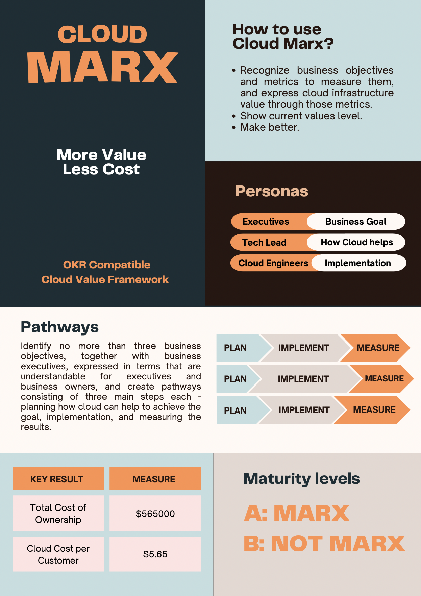

# Cloud Marx Framework

## Contents

The Open-Source Cloud Value Management Framework that is compatible with OKR methodology.

1. [What is Cloud Marx?](./00.whatiscloudmarx.md)
1. [Personas](./10.personas.md)
1. [Business Objectives](./20.businessobjectives.md)
1. [Key Results and their Metrics](./30.keyresults.md)
1. [Objective Lanes](./40.objectivelanes.md)
1. [Maturity](./50.maturity.md)

## Supporters

1. PDF Magazine for FinOps and Cloud Cost Management practitioners [The Cloud Coster](https://thecoster.cloud)

## Cheat Sheet

